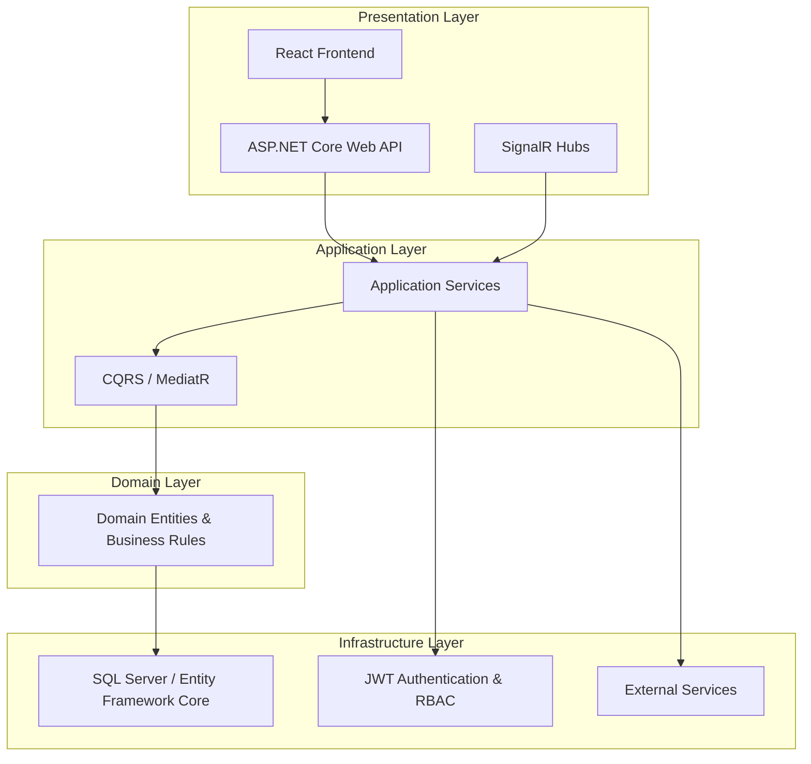

# Ustaad360 – Full-Stack Service Marketplace
### System Architecture & Design Documentation

> **Note**
> This repository serves as the official architectural documentation and system design reference for **Ustaad360**, my undergraduate capstone project. The complete application source code remains private to protect intellectual property and business logic. This repository showcases the system architecture, design decisions, technology stack, and software engineering practices behind the project.

---


## Overview

**Ustaad360** is a full-stack cloud-native service marketplace developed as my undergraduate capstone project for the Bachelor of Science in Computer Science.

The platform connects customers with verified technicians for home and business services while addressing one of the most significant challenges in service marketplaces: **trust**.

Rather than focusing only on service booking, Ustaad360 was designed around dependable software engineering principles, incorporating secure authentication, role-based authorization, escrow-oriented payment workflows, real-time communication, transparent dispute management, and a scalable Clean Architecture suitable for modern cloud-native applications.

Developing Ustaad360 strengthened my interest in advanced software systems and directly inspired my research interests in:

- Dependable Distributed Systems
- Cloud-Native Computing
- Microservices Architecture
- Fault-Tolerant Software Systems
- AI for Systems (AI4Systems)
- Trust Management in Distributed Platforms

These research interests form the foundation of my graduate studies and research proposals for the **Institute of Science Tokyo (Japan)** and **KAIST – Kim Jaechul Graduate School of AI (South Korea)**.

---

## System Architecture

The platform follows **Clean Architecture**, separating business logic from infrastructure and presentation layers to maximize maintainability, scalability, testability, and long-term extensibility.



### Architecture Principles

- Clean Architecture
- Dependency Injection
- SOLID Principles
- Repository Pattern
- Service-Oriented Design
- Modular Backend Components

---

# Technology Stack

### Backend

- ASP.NET Core Web API
- C#
- Entity Framework Core
- SQL Server

### Frontend

- React
- TypeScript

### Authentication & Security

- JWT Authentication
- Role-Based Access Control (RBAC)
- Refresh Tokens
- Authorization Policies

### Real-Time Communication

- SignalR

### Cloud & DevOps

- Docker
- Git
- GitHub

### API Documentation

- Swagger / OpenAPI

---

# Core Features

## Authentication

- User Registration
- Login
- JWT Authentication
- Refresh Tokens
- Password Hashing
- Secure Authorization

---

## Role-Based Access

- Customer
- Technician
- Administrator

Each role has dedicated authorization policies and protected endpoints.

---

## Technician Verification

Technicians can:

- Upload documents
- Complete profiles
- Submit verification requests

Administrators review and approve technician accounts before allowing service requests.

---

## Service Marketplace

Customers can:

- Browse services
- View technician profiles
- Create service requests
- Track job progress
- Review completed work

Technicians can:

- Accept jobs
- Manage requests
- Update job status
- Complete services

---

## Trust-Oriented Design

The platform was designed around trust rather than simple booking functionality.

Implemented mechanisms include:

- Escrow-inspired payment workflow
- Identity verification
- Role separation
- Transparent service lifecycle
- Review system
- Secure communication

These ideas later motivated my graduate research interests in dependable distributed systems and trustworthy cloud infrastructure.

---

## Real-Time Features

SignalR enables:

- Instant notifications
- Live messaging
- Job updates
- Status synchronization

---

## Administrative Dashboard

Administrators can:

- Manage users
- Verify technicians
- Review reports
- Moderate platform activity
- Monitor system operations

---

# Project Structure

```
src/

API/
Presentation Layer

Application/
Business Logic
CQRS
Services

Domain/
Entities
Interfaces
Business Rules

Infrastructure/
Entity Framework Core
Authentication
Persistence
External Services
```

---

# Skills Demonstrated

This project demonstrates practical experience with:

- Backend System Design
- REST API Development
- Clean Architecture
- Authentication & Authorization
- Entity Framework Core
- SQL Server
- SignalR
- Cloud-Native Development
- Docker
- Dependency Injection
- Software Design Principles
- Production API Development

---

# Research Motivation

Although Ustaad360 solves many trust-related challenges through authentication, authorization, and secure workflows, developing the platform exposed several research questions that cannot be addressed solely at the application layer.

Examples include:

- Detecting fraudulent user behavior
- Maintaining trust under distributed failures
- Intelligent anomaly detection
- Fault-tolerant cloud services
- Adaptive trust management
- Reliable distributed architectures

These challenges inspired my proposed graduate research in:

- Dependable Distributed Systems
- AI for Systems
- Cloud Computing
- Intelligent Cloud Infrastructure
- Fault-Tolerant Software Systems

---

# Future Improvements

Planned research-driven enhancements include:

- AI-assisted anomaly detection
- Distributed trust scoring
- Kubernetes deployment
- OpenTelemetry observability
- Prometheus & Grafana monitoring
- Redis caching
- RabbitMQ event-driven messaging
- Distributed tracing
- Cloud-native scalability
- Microservices architecture

---

# About the Author

**Mukhtiar Shah**

Backend Software Engineer | Distributed Systems & Cloud Computing Research Applicant

Research Interests:

- Dependable Distributed Systems
- Cloud Computing
- AI for Systems (AI4Systems)
- Fault-Tolerant Computing
- Cloud-Native Applications
- Backend Engineering

GitHub:
https://github.com/MUKHTIARSHAH

LinkedIn:
https://linkedin.com/in/mukhtiar-shah-4567221aa

Email:
shahsaib256@gmail.com

---

# License

This project is released under the MIT License.
